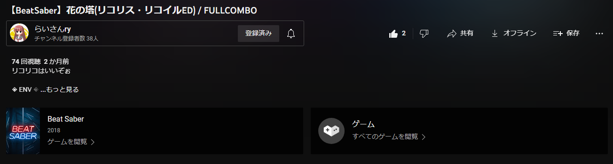

# YouTubeLegacyUI

YouTubeを新UIのMaterialYouを旧UI(2022/09)に近いもので上書きします。

## Install

coming soon...

## Details

### 下記の点を旧UIに変更

- ほとんどのボタン
- 検索ボックス
- チャンネル名表示
- カテゴリ等の詳細
- 自動再生ボタン
- サイドメニューホバー
- 広告元表示
- コメント欄の「もっと見る」ボタン
- 高評価等のユーティリティボタン

### 他変更点

- チャット開閉ボタンをチャット欄曲線に合うように修正

## Author

ライ([code-raisan](https://github.com/code-raisan))